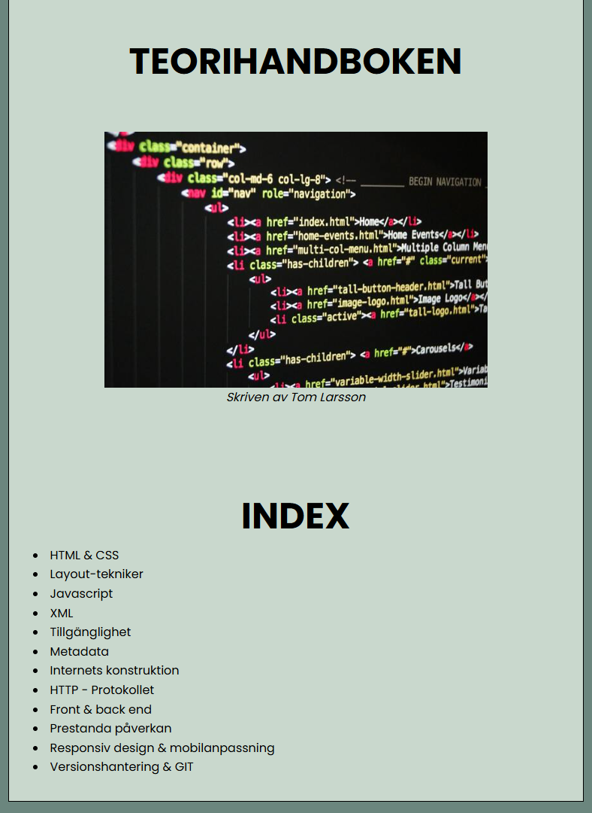
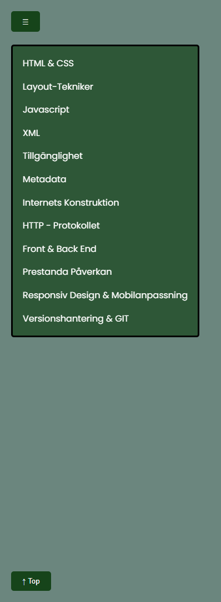

 
 

  

:point_right:<a href="https://tombenrex.github.io/Teorihandboken/" target="blank">Live Server</a> :point_left:

## 

Gjorde en hemsida av inlämningsuppgiften där vi skulle skriva en uppsats om de olika delarna som berör en utvecklare. 
En meny som dyker upp när man scrollat ner och en knapp för att komma tillbaka till toppen.

##

<h1 align="center">Hi 👋, I'm Tom Larsson</h1>
<h3 align="center">An upcoming frontend developer from Sweden</h3>

  

- 🌱 I’m currently learning **HTML, Javascript, CSS, React**

- 📫 How to reach me **92tomlar@skola.boras.se**

- ⚡ Fun fact **Started build houses now building webpages**

<h3 align="left">Connect with me:</h3>

<h3 align="left">Languages and Tools:</h3>

    

